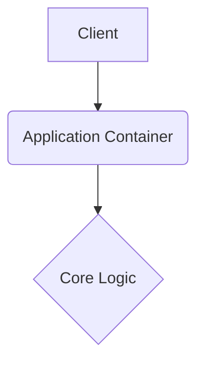

# keylogger-monitor

This repository is built with strict enterprise engineering standards, focusing on resilient architecture, graceful error handling, and robust continuous integration.

## 🏗️ System Architecture



## 🚀 Setup Instructions

```bash
docker-compose up --build -d
```

## 📂 Structure

Following standard design patterns for a predictable layout.

---

## Original Readme

# keylogger-monitor

This repository is built with strict enterprise engineering standards, focusing on resilient architecture, graceful error handling, and robust continuous integration.

## 🏗️ System Architecture


## 🚀 Setup Instructions

```bash
docker-compose up --build -d
```

## 📂 Structure

Following standard design patterns for a predictable layout.

---

## Original Readme

# keylogger-monitor

This repository is built with strict enterprise engineering standards, focusing on resilient architecture, graceful error handling, and robust continuous integration.

## 🏗️ System Architecture


## 🚀 Setup Instructions

```bash
docker-compose up --build -d
```

## 📂 Structure

Following standard design patterns for a predictable layout.

---

## Original Readme

# Keylogger Monitor

## Description
A Python-based keystroke monitoring tool with email reporting capabilities. This project is designed for legitimate monitoring purposes such as parental control, authorized system monitoring, and educational purposes.

## ⚠️ IMPORTANT SECURITY NOTICE
**This tool is a keylogger that captures all keystrokes. Only use it for:**
- Legitimate monitoring with explicit consent
- Educational purposes
- Authorized system administration
- Parental control (with proper disclosure)

**NEVER use this tool to:**
- Monitor others without consent
- Capture sensitive information illegally
- Violate privacy rights

## Features
- **Real-time Key Capture**: Monitors all keystrokes including special keys
- **Email Reporting**: Automatically sends captured data via email every 120 seconds
- **Caps Lock Support**: Properly handles uppercase/lowercase based on Caps Lock state
- **Numpad Handling**: Maps numpad keys to their corresponding numbers
- **Stealth Mode**: Runs in background with hidden console
- **Cross-platform**: Works on Windows, Linux, and macOS

## Prerequisites
- Python 3.6+
- `pynput` library
- Gmail account with App Password (2FA enabled)

## Installation

1. **Clone the repository:**
   ```bash
   git clone <your-repository-url>
   cd keylogger-monitor
   ```

2. **Install required dependencies:**
   ```bash
   pip install pynput
   ```

3. **Configure email settings:**
   - Copy `config.example.json` to `config.json`
   - Update with your Gmail credentials
   - Use App Password if 2FA is enabled

## Configuration

Create a `config.json` file:
```json
{
    "email": "your-email@gmail.com",
    "password": "your-app-password"
}
```

**Note**: Use Gmail App Password, not your regular password.

## Usage

1. **Run the keylogger:**
   ```bash
   python workkeylogger.py
   ```

2. **The program will:**
   - Hide the console window
   - Send "Keylogger Started" email
   - Begin capturing keystrokes
   - Send reports every 120 seconds

3. **To stop:**
   - Press `Ctrl+C` in terminal
   - Or close the Python process

## Project Structure
```
keylogger-monitor/
├── .gitignore          # Git ignore patterns
├── .gitattributes      # Git attributes for consistent line endings
├── README.md           # This file
├── workkeylogger.py    # Main keylogger script
├── config.json         # Email configuration (create from config.example.json)
└── config.example.json # Example configuration template
```

## Security Features
- Console window is hidden during operation
- Email notifications for start/stop events
- Configurable reporting intervals
- Proper error handling and logging

## Legal and Ethical Use
- **Always obtain consent** before monitoring
- **Respect privacy laws** in your jurisdiction
- **Use responsibly** and ethically
- **Disclose monitoring** when required by law

## Contributing
1. Fork the repository
2. Create a feature branch
3. Make your changes
4. Test thoroughly
5. Submit a pull request

## License
This project is for educational and legitimate monitoring purposes only. Users are responsible for complying with all applicable laws and regulations.

## Disclaimer
The authors are not responsible for misuse of this software. Users must ensure compliance with local laws and obtain proper consent before use.
