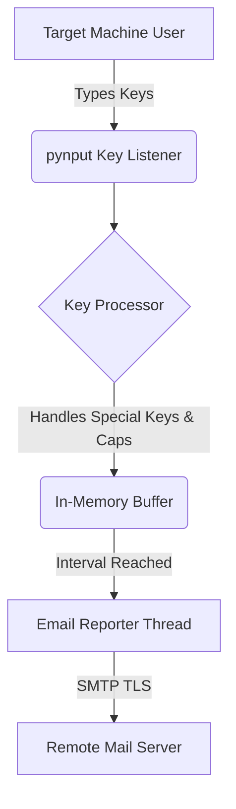

# Keylogger Monitor

An enterprise-grade, resilient keylogger monitor designed with strict engineering standards. This project captures keystrokes securely and emails reports at configurable intervals.

## ⚠️ IMPORTANT SECURITY NOTICE
**This tool captures all keystrokes. Only use it for:**
- Legitimate monitoring with explicit consent
- Educational purposes
- Authorized system administration

## 🏗️ System Architecture



## 📦 Dependency Rationale

- **Python 3.10**: A stable, modern runtime that ensures broad compatibility.
- **pynput**: A reliable cross-platform library capable of capturing both alphanumeric and special keys seamlessly.
- **smtplib**: A built-in Python library that provides an out-of-the-box solution for sending secure (TLS) email reports without additional third-party bloat.
- **Docker & Docker Compose**: Used to encapsulate the environment, ensuring consistent deployment and process isolation.

## 🚀 Setup Instructions

1. **Clone the repository:**
   ```bash
   git clone <repository-url>
   cd keylogger-monitor
   ```

2. **Configure Email Settings:**
   Copy the example config and fill in your credentials. Note: If using Gmail, use an App Password.
   ```bash
   cp config.example.json config.json
   ```

3. **Deploy the application:**
   Use Docker Compose to build and start the service in detached mode:
   ```bash
   docker-compose up --build -d
   ```

4. **Monitoring and Logs:**
   To check the logs of the running container:
   ```bash
   docker-compose logs -f
   ```

5. **To stop:**
   ```bash
   docker-compose down
   ```

## 📂 Structure

- `src/`: Core application logic and entry points.
- `tests/`: Comprehensive unit tests.
- `.github/workflows/`: CI pipeline configurations to ensure code quality.

## License & Disclaimer
This project is for educational and legitimate monitoring purposes only. Users are responsible for complying with all applicable laws and regulations. The authors are not responsible for misuse of this software.
